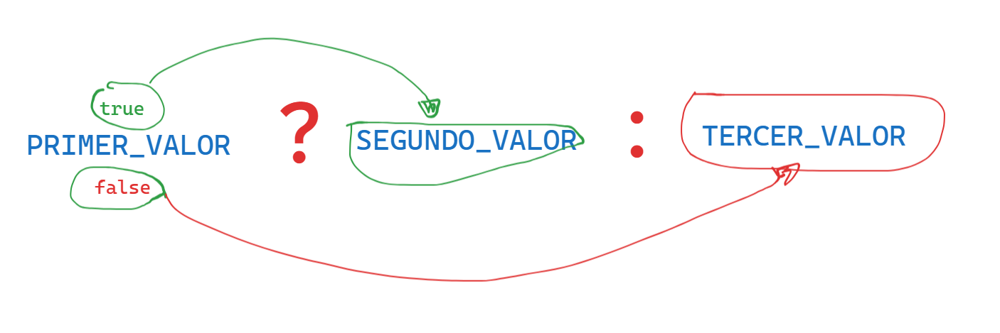

# VALORES, TIPOS Y OPERADORES
 INDICE
- [VALORES, TIPOS Y OPERADORES](#valores-tipos-y-operadores)
  - [Valores](#valores)
    - [Datos primitivos:](#datos-primitivos)
      - [Numeros(Number):](#numerosnumber)
      - [Aritmetica](#aritmetica)
      - [Cadena (string)](#cadena-string)
      - [Concatenacion](#concatenacion)
      - [Plantillas literares](#plantillas-literares)
      - [Operadores Unarios](#operadores-unarios)
      - [Valores Booleano](#valores-booleano)
      - [OPERADOR TERNARIO (utiliza 3 valores):](#operador-ternario-utiliza-3-valores)
## Valores
Imagina un mar de bits


Una computadora moderna tiene mas de 100 mil millones de bits almacenados en su `memoria de trabajo` o `memoria principal` o `memoria volatil` o `ram`.
Ahora la memoria no volatil o memoria secundaria o memoria de almacenamiento tiene estos bits de manera ordenada generalmente apilada como si de un estante de una biblioteca se tratara.

cuando nosotros programamos hacemos uso de `memoria de trabaj○`,
para trabajar con los bits que se encuentran en nuestro mar de bits, javascript ordena los bits en pequeñas partes o piezas de informacion a esto se le conoce como **VALORES**

Cada valor tiene una funcionalidad distinta puede ser un numero, texto o una funcion.
cuando habloamos de tipo de datos de javascript nos referimos a su representacion binaria y al tipo de valor que usamos. **En JavaScript se le conoce como:**
### Datos primitivos:
son aquellos datos que ya existen no pueden ser creados, actualizados ni eliminados solo pueden ser llamados para el uso que deseamos dar.
Los datos primitivos en javascript son:
#### Numeros(Number): 
Los valores de tipo numero como es de esperar son numero y en javascript se escribe o se hace el llamado de este valor de la siguiente manera:

- **NUMERO DE TIPO ENTERO**
```js
//estamos usando un patron de bits para el numero 20 que existia dentro de la memoria de trabajo.
// este numero es entero positivo
20
// esto es numero entero negativo
-20
```
- **NUMERO DE PUNTO FLOTANTE DECIMAL FRACCION**
```JS
// decimal positivo
2.7 
.0
0.
//decimal negativo
-2.7 
```
- **NUMEROS DE NOTACION CIENTIFICA:**
```JS
// decimal positivo
2.998e8 //Esta info se almacena en 64 bits
//2,998*10^8

// decimal negativo
-2.998e8
```
> [!WARNING]
> Cuando javascript realiza operacion con numeros enteros el resultado simepre sera exacto, cuando realice operaciones con numeros decimales el resulado perdera presicion por que solo tiene 64 bits para almacenar esto suele ocurrir con resultados cuyos decimales sean infinitos com en el caso del numero pi. **Es nuestra responsabilidad como programador hacer el uso de los decimales con aproximaciones para evitar errores.**

> [!TIP]
> Cuando javascript hace trabajo de memoria **(cuando crea un patron de bits para almacenar)** todos los numeros son almacenados como decimal positivo.


- **NUMEROS ESPECIALES**
  En JavaScript existen tres valores de tipo numero que se consideran un dato primitivo numerico de tipo especial.

  ```Js
  Infinity // cuando la operacion muestra un resultado infinito.
  - Infinity // cuando la operacion es de numeros negativo.
  NaN //not a number ("no es un numero").
  // cuando el resultado de la operacion es matematicamente imposible te muestra el msj de (NaN).
 
  ```
#### Aritmetica 
 La aritmetica(Operadores aritmeticos)principal operacion que se puede hacer con numeros es la aritmetica.
 Para esto tenemos lo operadores aritmeticos como:
 - suma(+).
 - resta (-).
 - multiplicacion (*).
 - division (/).
 - potencia (**).
 - modulo (%).
 - incremento (++)
 - decremento (--)
  
**Podemos agrupar operaciones con parentesis () las operaciones que esten entre las parentesis se jecutaran primero**

 Cosulta el archivo de operadores [aqui](./operadores.js)

  Ve los ejercicios [aqui](./ejercicios.js)
   
#### Cadena (string)
El siguiente tipo de dato primitivo es la `cadena` = `string`.
¿Para que se usan las cadenas en JavaScript?
- Para representar un texto:
  se escribe encerrando su contenido entre comillas:
  ```js
  //cadenas con coontenido
  "soy un texto" //comillas dobles
  'tambien soy un texto' //comillas simple
  `yo tambien` //acento grave

  //cadena vacia
  ""
  ```
**Problema** - Como representamos un texto entre comillas 
para hacer el uso de comillas dentro del contenido de una cadena podemos seguir las siguientes recomendaciones:
```js
//si nuestro texto tiene que estar entre comillas simple
console.log("'este texto se muestra entre comillas simples'")
//si nuestro texto tiene que estar entre comillas simple
conosle.log('" este texto se muestra entre comillas dobles"')
//si nuestro texto tendra tanto comillas dobles como simples
console.log(`'comilla simple' , "comilla doble"`)
```
otra manerade de hacer lo antes mencionado es haciendo uso de la barra invertida `\` tambien conocida como `caracter de escape`.
Hacer uso de este caracter indica que el caracter posterior tendra un significado especial.
```js
console.log("este texto solo esta \"palabra\" estara en comillas")
```
> [!TIP] 
> el acentro grave se incorporo despues de **enmascript 6** antes de ello solo se utilizaba el caracter de escapae `\`

**Problema** - deseamos agregar un salto de linea en nuestro texto.
```js
//solucionamos este problema haciendo uso de los acentos graves
`
aqui linea 1
aqui 2 linea` //si queremos que se muestre de manera ordena debe escribir de esta manera caso contrario se mostrar desordenado
```
antes de la incorporacion de enmascript6 (es6) en el uso de acentos graves se utilizaba el cararter de escape `\`

```js
"esta es la primera linea \n
y esta es la segunda linea"

```
**Problema** - deseo tabular un texto
```js
`
este texto no esta tabulado
    este texto si esta tabulado
`
```
Ahora tabularemos ahciendo uso del caracter de escape ( \ )

```js
console.log("Tabulado \n \t No tabulado")
```
#### Concatenacion

El unico operador aritmetico que puede ser usado por cadenas es el operador de suma (+) pude ser usado entre dos o mas cadenas y pasa a llamarse operador de concatenacion, lo que realiza es unir cadena en una sola.

```js
"hola"+" "+"mundo"

```
#### Plantillas literares
Las plantillas literles mencionadas anteriormente con el nombre de **acento grave** son usadas para mostrar texto literal, tambien nos permite ejecutar codigo JS dentro de una plantilla literal el codigo o resultado del codigo sera transformado en un dato de tipo texto y sera incluira en la posicion en que se encuentre.
Para hacer uso de esta funcionalidad debemos usar, la expresion `${}`

```js
// creando una plantilla literal -- template literals

//usando JS dentro de una plantilla literal
```
> [!TIP]
> Se dice literal porque con el formato que codificamos sera mostrado de esa misma forma en la consola.

#### Operadores Unarios
No todos los operadores son simbolo, algunos se escriben como palabras.
Un ejemplo es el operador`typeof`, es el operador que produce un valor de cadena que indica el tipo de valor que le proporcionamos.
`Operadores binarios` se les conoce por que operan sobre dos valores `2*5`

```js
//para poder ver su funcionalidad o valor que genera siempre debemos mostrarlo en un console
console.log(typeof 5)
```
#### Valores Booleano
este tipo de dato primitivo es util cuando tenemos un valor que distinga solo entre dos posibilidades, como `si` y `no` o `encendido` y `apagado`.
para este proposito, JavaScript tiene dos tipos de datos `Booleano`, que tiene solo dos valores, `True` y `False`.

**Que formas de producir valores booleanos tenemos?**
1. **Usando operadores de comparacion**: 
   Los operadores de comparacion son:
   - Mayor que (>)
   - Menor que (<)
   - Mayor o igual que (>=)
   - Menor o igual que (<=)
   - Igual a (===)
   - Estrictamente igual (===)
   - No es igual a (!=)
  
2. **Operadores Logicos**:
   JavaScript soporta tres operadores logicos:
   - AND (Y) EN JAVASCRIPT `&&`.
   - OR (O) EN JAVASCRIPT `||`.
   - NOT (NO) EN JAVASCRIPT `!`, 
  **OBSERVACIO:NOT este es un operador unario que su funcion es invertir el valor que tiene a su derecha `!TRUE` produce `FALSE`**

> [!TIP] 
> **AND `&&`** - si tenemos dos valores verdaderos devolvera el segundo valor verdadero, si tenemos un valor falso y uno verdadero devolvera el valor falso
>
> **OR `||`** - Si tenemos dos valores verdaderos devolvera el primer valor verdadero, si tenemos un valor verdadero y uno falso devolvera el valor verdadero (sea cual sea la posicion).

>[!TIP]
> APARTIR DE ENMASCRIPT6 SE USA **(ES6)** `??`

3. **Usando el operador relacional**:
   Este operador compara sus valores y retorna un booleano como resultado.
   Lo que evalua este operador es si propiedad especifica se encuentra en un objeto.
   Evalua que si el primer valor que se encuentra a su izquierda forma parte del segundo valor que se encuentra a su derecha.

   ```js
   "a" in ["a","e","i","o","u"]
   ```
#### OPERADOR TERNARIO (utiliza 3 valores):
Este operador trabaja con 3 valores.
El primer valor es el que determinara si se muestra el resto de los valores.
Eso quiere decir que si el primer valor es verdadero mostrara el segundo valor mientras que si falso mostrara el tercer valor

